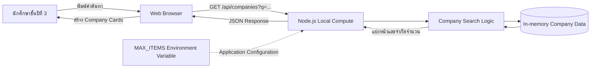
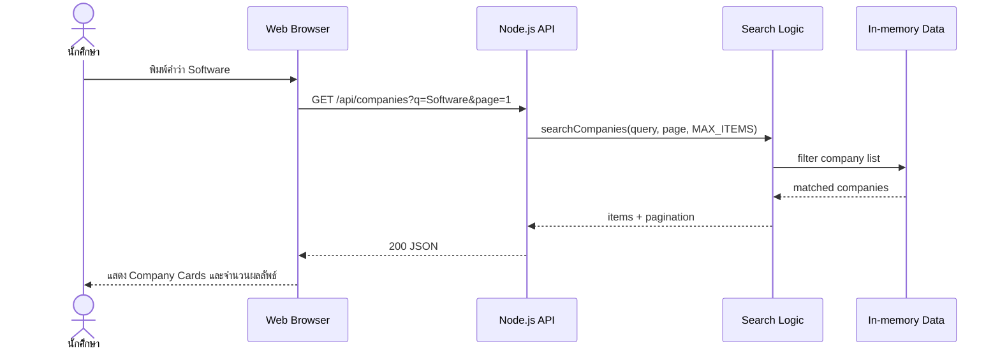

# Local Compute Layer Preparation

เอกสารนี้อธิบาย Minimal Working Application ที่เตรียมไว้สำหรับหัวข้อ **Adding a Compute Layer** โดยเป็น Local Prototype เท่านั้น ยังไม่ได้ Deploy ขึ้น AWS และยังไม่ได้ใช้ตัดสินใจว่า Production ควรใช้ EC2, Serverless หรือ Compute รูปแบบใด

## สิ่งที่เตรียมตามโจทย์

| สิ่งที่ต้องเตรียม | สิ่งที่ทำใน CO-ED |
| --- | --- |
| Minimal Working Application | Node.js HTTP server ที่ให้บริการเว็บไซต์และ Company Search API |
| Dynamic Behavior | รับคำค้นหา แล้วค้นชื่อบริษัท สถานที่ ตำแหน่ง และ Keyword ก่อนส่งผลลัพธ์ JSON |
| Mock / In-memory data | ข้อมูลบริษัทเก็บใน `data/companies.js` และโหลดเข้า Memory เมื่อเริ่ม Application |
| Configurable value | `MAX_ITEMS` กำหนดจำนวนผลลัพธ์สูงสุดต่อหน้า |
| Run locally | `npm start` แล้วเปิด `http://localhost:3000/company-directory.html` |
| Test locally | `npm test` และทดสอบ API ด้วย `curl` |

## ภาพรวม Application



ภาพนี้มี Flow สำคัญสองส่วน:

1. **Runtime flow** — ผู้ใช้พิมพ์คำค้นหา Browser ส่ง HTTP request ไปยัง Node.js จากนั้น Node.js ค้นข้อมูลใน Memory และส่ง JSON กลับมาให้ Browser แสดงผล
2. **Configuration flow** — ค่า `MAX_ITEMS` ถูกอ่านเมื่อเริ่ม Node.js และกำหนดว่าหนึ่ง Response ส่งบริษัทกลับได้สูงสุดกี่รายการ

## Request และ Response Flow



## Dynamic Behavior

Endpoint หลักคือ:

```http
GET /api/companies?q=<search-term>&page=<page-number>
```

Search Logic ทำตามลำดับต่อไปนี้:

1. รับ `q` และ `page` จาก URL query parameters
2. ตัดช่องว่างและเปลี่ยนข้อความเป็นตัวพิมพ์เล็ก
3. รวมชื่อบริษัท สถานที่ ตำแหน่ง สวัสดิการ และ Keyword เป็นข้อความสำหรับค้นหา
4. ใช้ `filter()` และ `includes()` เลือกบริษัทที่ตรงกับคำค้นหา
5. ใช้ `MAX_ITEMS` คำนวณ Pagination และจำกัดจำนวนรายการใน Response
6. ส่ง `items` และข้อมูล `pagination` กลับเป็น JSON
7. Browser สร้าง Element ของ Company Card ด้วย DOM API และแสดงผลบนหน้าเว็บ

ตัวอย่าง Request:

```http
GET /api/companies?q=software&page=1
```

ตัวอย่าง Response เมื่อ `MAX_ITEMS=2`:

```json
{
  "query": "software",
  "items": [
    {
      "id": "agoda",
      "name": "Agoda",
      "location": "กรุงเทพฯ",
      "position": "วิศวกรซอฟต์แวร์"
    },
    {
      "id": "g-able",
      "name": "G-Able",
      "location": "กรุงเทพฯ",
      "position": "วิศวกรซอฟต์แวร์"
    }
  ],
  "pagination": {
    "page": 1,
    "pageSize": 2,
    "total": 4,
    "totalPages": 2,
    "hasNextPage": true
  }
}
```

จำนวนจริงใน `total` ขึ้นอยู่กับข้อมูล Mock ปัจจุบัน

## Application Configuration

Application รองรับ Environment Variables ต่อไปนี้:

| ชื่อ | Default | ผลต่อ Application |
| --- | ---: | --- |
| `PORT` | `3000` | Port ที่ Local HTTP server รอรับ Request |
| `MAX_ITEMS` | `6` | จำนวนบริษัทสูงสุดที่ API ส่งกลับต่อหน้า |

ตัวอย่างการเปลี่ยน Configuration:

```bash
MAX_ITEMS=3 npm start
```

เมื่อค้นหา API จะส่งผลกลับไม่เกิน 3 รายการต่อหน้า หากเปลี่ยนเป็น `MAX_ITEMS=8` จะส่งได้ไม่เกิน 8 รายการต่อหน้า โดยไม่ต้องแก้ Source code

ไฟล์ `.env.example` ใช้แสดงชื่อและค่าตัวอย่างของ Configuration ส่วนไฟล์ `.env` จริงถูก Ignore และไม่ควร Commit ขึ้น Repository ใน Prototype นี้ให้กำหนด Environment Variable ตอนสั่ง Run โดยตรง

## วิธี Run บน Local

ต้องมี Node.js 18 ขึ้นไป จาก Root ของ Repository รัน:

```bash
npm install
npm start
```

ผลที่ Terminal ควรแสดง:

```text
CO-ED local application: http://localhost:3000
MAX_ITEMS=6
```

จากนั้นเปิด:

```text
http://localhost:3000/company-directory.html
```

หยุด Application ด้วย `Ctrl + C`

### Run ด้วย Configuration อื่น

macOS หรือ Linux:

```bash
MAX_ITEMS=3 PORT=3001 npm start
```

Windows PowerShell:

```powershell
$env:MAX_ITEMS=3
$env:PORT=3001
npm start
```

## วิธี Test

### Automated Test

```bash
npm test
```

Test ครอบคลุม:

- การ Normalize คำค้นหาและไม่สนตัวพิมพ์เล็ก/ใหญ่
- การค้นด้วยชื่อบริษัทและตำแหน่งงาน
- กรณีไม่พบข้อมูล
- Pagination และผลของ `MAX_ITEMS`
- Configuration ที่ไม่ถูกต้องและการใช้ค่า Default
- Health endpoint
- Company API endpoint
- การให้บริการหน้า Company Directory จาก Local server

### Manual API Test

ตรวจสถานะ Application และค่า Config ที่กำลังใช้:

```bash
curl http://localhost:3000/api/health
```

ค้นหาด้วยภาษาไทย:

```bash
curl "http://localhost:3000/api/companies?q=วิศวกรซอฟต์แวร์"
```

ค้นหาด้วยภาษาอังกฤษ:

```bash
curl "http://localhost:3000/api/companies?q=software"
```

ทดสอบกรณีไม่พบข้อมูล:

```bash
curl "http://localhost:3000/api/companies?q=not-found"
```

## Demo Flow ในชั้นเรียน

1. รัน `npm test` เพื่อแสดงว่า Search Logic และ API ผ่าน Test
2. รัน `MAX_ITEMS=2 npm start`
3. เปิดหน้า Company Directory ผ่าน `localhost:3000`
4. ค้นคำว่า `software` และอธิบายว่า Browser ส่ง Request ไป Compute Layer
5. เปิด Browser Network หรือเรียก API ด้วย `curl` เพื่อแสดง JSON Response
6. กด “ดูเพิ่มเติม” เพื่อเรียก Page ถัดไป
7. หยุด Server แล้วรันใหม่ด้วย `MAX_ITEMS=6 npm start`
8. ค้นคำเดิมและแสดงว่าจำนวนรายการต่อหน้าเปลี่ยนโดยไม่ได้แก้ Source code

## Static Fallback

`company-directory-compute.js` พยายามเชื่อมต่อ `/api/companies` เมื่อเปิดหน้าเว็บผ่าน Local Node.js server หาก API ใช้งานไม่ได้ เช่น เปิดไฟล์ HTML โดยตรงหรือเปิดจาก Static Hosting ระบบจะกลับไปใช้การค้นหาการ์ดใน HTML แบบเดิม

Fallback มีไว้เพื่อไม่ให้เว็บไซต์ V1 เดิมหยุดทำงาน แต่ระหว่าง Demo Compute Layer ต้องเปิดผ่าน URL `http://localhost:3000/company-directory.html` และควรเห็นข้อความ `Local Compute API` บนหน้ารายการบริษัท

## ขอบเขตของ Prototype

Prototype นี้ตั้งใจให้เล็กและใช้ประกอบการเรียนรู้ จึงยังไม่มี:

- Database หรือ Persistent storage
- Create, Update และ Delete
- Authentication และ Authorization
- การจัดเก็บข้อมูลส่วนบุคคล
- AWS deployment
- การตัดสินใจเลือก EC2, Lambda, Container หรือ Compute รูปแบบอื่น

หลังจากทดลองในคลาสจึงค่อยเปรียบเทียบ Compute แต่ละแบบและปรับ Architecture ให้ตรงกับระบบที่ตัดสินใจใช้จริง
