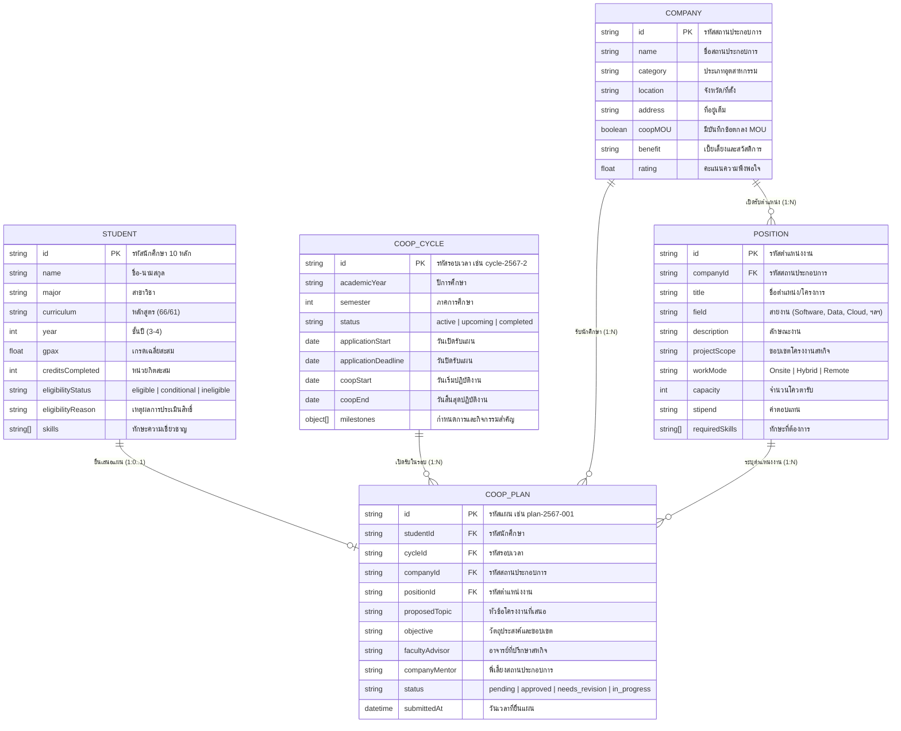
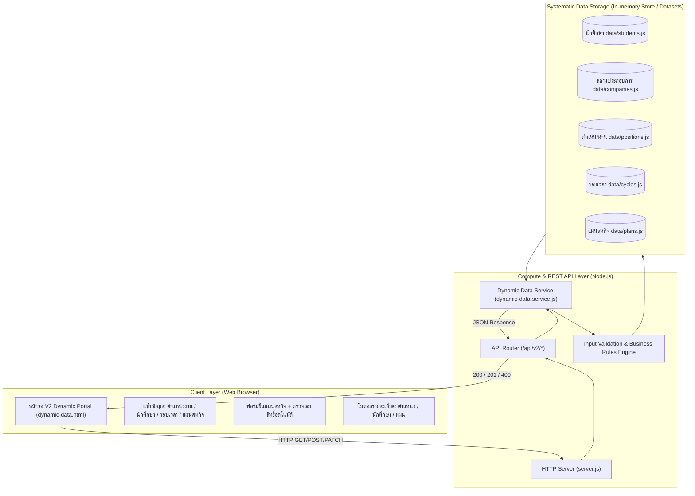

# CO-ED Version 2: Dynamic Data Management Architecture

เอกสารนี้อธิบายสถาปัตยกรรมและการทำงานของ **CO-ED Version 2 (V2 – Dynamic Data)** ซึ่งพัฒนาต่อยอดจาก Version 1 (Information) เพื่อยกระดับจากการเผยแพร่ข้อมูล Static สู่ระบบจัดเก็บและเรียกใช้ข้อมูลแบบพลวัตอย่างเป็นระบบ พร้อมรองรับการค้นหา กรอง และเรียกดูตามเงื่อนไขอย่างครบถ้วน

---

## 1. เปรียบเทียบความแตกต่างระหว่าง V1 และ V2

| มิติ | V1 – Information | V2 – Dynamic Data |
| --- | --- | --- |
| **เป้าหมายหลัก** | เผยแพร่ข้อมูลพื้นฐาน ขั้นตอน คุณสมบัติ และรายชื่อสถานประกอบการเบื้องต้น | จัดเก็บ เรียกใช้ ค้นหา กรอง และจัดการข้อมูล 5 กลุ่มหลักอย่างเป็นระบบ |
| **แหล่งข้อมูล (Data Source)** | ข้อความ Static ฝังใน HTML และไฟล์ JavaScript แบบอ่านอย่างเดียว | ชุดข้อมูลเชิงโครงสร้าง (Structured Datasets) และ Dynamic Data Store พร้อม CRUD & REST API |
| **ความสัมพันธ์ของข้อมูล** | ข้อมูลแยกส่วน ไม่มี Relational Linking | ข้อมูลเชื่อมโยงสัมพันธ์กัน (นักศึกษา $\leftrightarrow$ แผนสหกิจ $\leftrightarrow$ สถานประกอบการ $\leftrightarrow$ ตำแหน่งงาน $\leftrightarrow$ รอบเวลา) |
| **การประมวลผล (Compute Layer)** | Client-side DOM filtering อย่างง่าย | Node.js REST API Server พร้อม Query Service, Multi-facet Filtering, Pagination, Sorting และ Validation |
| **การจัดการสถานะและแผน** | ไม่มี (ดูได้อย่างเดียว) | สามารถเสนอแผนสหกิจใหม่ ตรวจสอบคุณสมบัติอัตโนมัติ และอัปเดตผลการพิจารณา (Approve/Needs Revision) |
| **การรองรับ Offline / Static Fallback** | รองรับการเปิดไฟล์ HTML ตรง | รองรับ 2 โหมด: Local Compute API และ Bundled Fallback เพื่อความยืดหยุ่น |

---

## 2. โครงสร้างชุดข้อมูลหลักทั้ง 5 กลุ่ม (5 Core Systematic Entities)

ระบบ V2 จัดเก็บและเชื่อมโยงข้อมูลสหกิจศึกษาของสาขาวิชาวิทยาการคอมพิวเตอร์ มหาวิทยาลัยธรรมศาสตร์ ออกเป็น 5 มิติหลัก:



---

## 3. สถาปัตยกรรมระบบ (System Architecture)



---

## 4. รายการ REST API Endpoints (Version 2)

### 4.1 ภาพรวมแดชบอร์ด
- **`GET /api/v2/summary`**
  - คืนค่าสถิติรวมของระบบ: จำนวนนักศึกษา (แยกตามสิทธิ์), สถานประกอบการ (แยก MOU), ตำแหน่งงานที่เปิดรับ, โควตารับรวม, สถานะรอบปัจจุบัน และสถิติการอนุมัติแผน

### 4.2 ข้อมูลนักศึกษาและสิทธิ์ (Students)
- **`GET /api/v2/students`**
  - Query Parameters: `q`, `eligibility` (`all`, `eligible`, `conditional`, `ineligible`), `year` (`all`, `3`, `4`), `curriculum`, `sortBy` (`name`, `gpax`, `creditsCompleted`, `id`), `page`, `pageSize`
- **`GET /api/v2/students/:id`**
  - คืนค่าข้อมูลประวัตินักศึกษาอย่างละเอียด พร้อมแผนสหกิจศึกษาที่ผูกอยู่ (ถ้ามี)

### 4.3 สถานประกอบการ (Companies)
- **`GET /api/v2/companies`**
  - Query Parameters: `q`, `category`, `location`, `hasMOU` (`all`, `true`, `false`), `page`, `pageSize`
- **`GET /api/v2/companies/:id`**
  - คืนค่าข้อมูลสถานประกอบการ พร้อมรายการตำแหน่งที่เปิดรับ และแผนของนักศึกษาที่ได้รับการอนุมัติ

### 4.4 ตำแหน่งงานและโครงการ (Positions)
- **`GET /api/v2/positions`**
  - Query Parameters: `q`, `field` (สายงาน), `workMode` (`Hybrid`, `Onsite`, `Remote`), `companyId`, `status`, `page`, `pageSize`
- **`GET /api/v2/positions/:id`**
  - คืนค่ารายละเอียดตำแหน่งงาน ขอบเขตโครงงาน ค่าตอบแทน และข้อมูลบริษัทผู้รับสมัคร

### 4.5 รอบเวลาและกำหนดการ (Cycles & Milestones)
- **`GET /api/v2/cycles`**
  - คืนค่ารอบเวลาทั้งหมด กรองตาม `status` (`active`, `upcoming`, `completed`)
- **`GET /api/v2/cycles/active`**
  - คืนค่ารอบสหกิจศึกษาปัจจุบันที่เปิดรับ พร้อมกำหนดการและ Milestones
- **`GET /api/v2/cycles/:id`**
  - คืนค่ารายละเอียดของรอบเวลาตามรหัส

### 4.6 แผนสหกิจศึกษา (Co-op Plans)
- **`GET /api/v2/plans`**
  - Query Parameters: `q`, `status` (`approved`, `pending`, `needs_revision`, `in_progress`), `cycleId`, `companyId`, `studentId`, `page`, `pageSize`
- **`GET /api/v2/plans/:id`**
  - คืนค่าข้อมูลแผนอย่างละเอียด พร้อมข้อมูลนักศึกษา บริษัท ตำแหน่งงาน และรอบเวลา
- **`POST /api/v2/plans`**
  - บันทึกการเสนอแผนสหกิจใหม่ มีการตรวจสอบคุณสมบัติ (Validation):
    1. ต้องระบุนักศึกษา, รอบเวลา, สถานประกอบการ และตำแหน่งงาน
    2. นักศึกษาต้องผ่านเกณฑ์คุณสมบัติ (eligible หรือ conditional)
    3. นักศึกษาต้องยังไม่มียื่นแผนในรอบเดียวกันซ้ำ
    4. ต้องมีหัวข้อโครงงานและวัตถุประสงค์
  - รหัสแผนสร้างแบบอัตโนมัติ (`plan-2567-xxx`) พร้อมตั้งสถานะเป็น `pending`
- **`PATCH /api/v2/plans/:id`**
  - อัปเดตสถานะการพิจารณา (`status`: `approved`, `needs_revision`, `pending`), ความเห็นของกรรมการ (`reviewNotes`) และอาจารย์ที่ปรึกษา (`facultyAdvisor`)

---

## 5. การค้นหา กรอง และเรียกดูตามเงื่อนไข (Search, Filtering & Condition Handling)

1. **การค้นหาแบบหลายมิติ (Multi-facet Search):**
   - รองรับคำค้นหาทั้งภาษาไทยและภาษาอังกฤษ
   - ค้นหาแบบรวมหลายฟิลด์ (Cross-field Search) เช่น ค้น "React", "KBTG", "ชานนท์", "Caching", "6609650012"
2. **การกรองตามเงื่อนไขทางธุรกิจ (Business Condition Filtering):**
   - กรองนักศึกษาตามสิทธิ์ความพร้อม (ผ่านเกณฑ์, รอตรวจสอบหน่วยกิต, ไม่ผ่านเกณฑ์ตามเกณฑ์ GPAX < 2.00 หรือหน่วยกิต < 90)
   - กรองตำแหน่งงานตามสายงาน (Software Engineering, Data Science & AI, Cloud & DevOps, Cybersecurity, UX/UI Design, QA)
   - กรองตามรูปแบบการทำงาน (Hybrid, Onsite, Remote) และสถานประกอบการ
   - กรองแผนสหกิจตามสถานะการอนุมัติ (ผ่านการอนุมัติ, รอการพิจารณา, ส่งกลับแก้ไข)
3. **การเรียงลำดับและแบ่งหน้า (Sorting & Pagination):**
   - เรียงตาม GPAX, หน่วยกิต, รหัสนักศึกษา, ชื่อ-นามสกุล หรือวันที่ยื่นแผน
   - ควบคุมจำนวนรายการต่อหน้าผ่าน `pageSize` หรือค่าตัวแปรสภาพแวดล้อม `MAX_ITEMS`

---

## 6. วิธีการเปิดใช้งานและการทดสอบ

### 6.1 การสั่งรันบน Local Server
```bash
npm start
```
จากนั้นเปิดเบราว์เซอร์ที่:
- **หน้าหลัก V2:** [http://localhost:3000/dynamic-data.html](http://localhost:3000/dynamic-data.html)
- **หน้าแรก:** [http://localhost:3000/index.html](http://localhost:3000/index.html)
- **ทำเนียบสถานประกอบการ V1:** [http://localhost:3000/company-directory.html](http://localhost:3000/company-directory.html)

### 6.2 การรันชุดทดสอบอัตโนมัติ (Automated Tests)
รันชุดทดสอบทั้งหมด 29 รายการ:
```bash
npm test
```
ครอบคลุม:
- การสืบค้นและค้นหาตำแหน่งงาน/สถานประกอบการ
- การคำนวณและกรองสิทธิ์นักศึกษาตามเกณฑ์
- การสร้างและแก้ไขแผนสหกิจศึกษาพร้อม Validation ป้องกันข้อมูลผิดพลาด
- การคำนวณสรุปสถิติภาพรวมแดชบอร์ด
- การทำงานของ REST API Endpoints และ CORS Preflight

---

## 7. ขอบเขตความสำเร็จของ Version 2

- [x] จัดเก็บข้อมูล 5 กลุ่มหลัก (นักศึกษา, สถานประกอบการ, ตำแหน่ง/โครงการ, รอบเวลา, แผนสหกิจ) อย่างเป็นระบบ
- [x] รองรับการค้นหา กรอง และเรียกดูตามเงื่อนไขอย่างอิสระ
- [x] มี REST API Backend ให้บริการข้อมูลแบบ Dynamic ผ่าน Node.js
- [x] มีหน้าจอ Dashboard สรุปภาพรวมและตัวชี้วัดความพร้อมของระบบ
- [x] มีระบบยื่นแผนสหกิจศึกษาออนไลน์ พร้อม Validation ตรวจสอบสิทธิ์นักศึกษา
- [x] มีระบบจำลองการพิจารณาและอนุมัติแผนโดยอาจารย์/คณะกรรมการ (Approve / Needs Revision)
- [x] รองรับ Responsive Design ทั้งบน Desktop, Tablet และ Mobile
- [x] มีชุดทดสอบอัตโนมัติ 29 รายการ ผ่าน 100%
